## 搭建node.js环境

(1)安装node.js
(2)测试是否安装成功:node -v、npm -v

### 安装Hexo博客框架工具

```bash
npm install hexo-cli -g
```
(注:若报错,请尝试在命令前加上sudo)

## 安装Git版本工具

下载地址：https://git-scm.com/downloads 
Windows系统需下载，Mac系统因为自带Git无需操作。 
测试安装：git - -version，查看显示版本号即成功

## 注册github账号，如果已有就直接使用

## 开始搭建Hexo博客

(1)在github上面新建一个代码仓库，例如：yqhJsp.github.io(yqhJsp是你的用户名)

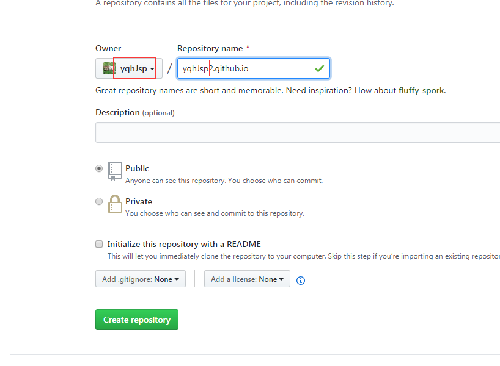

(2)进入该仓库的setting，找到github pages，选择主题

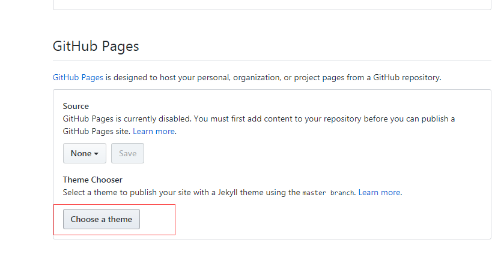

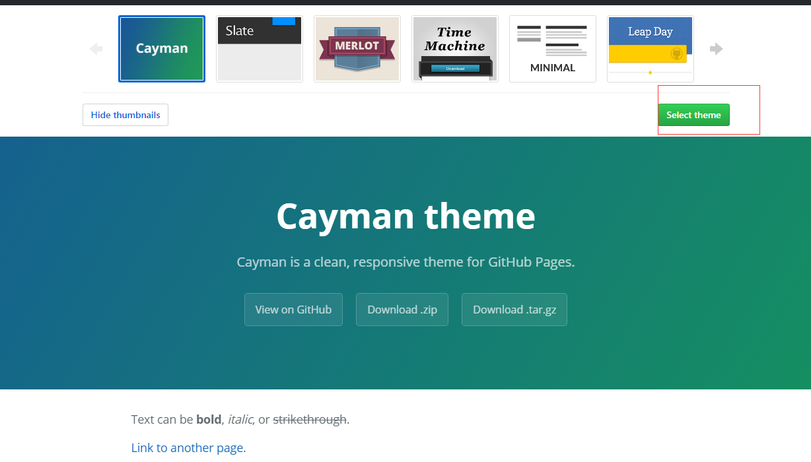

(3)选完主题确定后返回setting,此时可以看到github pages上有该博客的域名
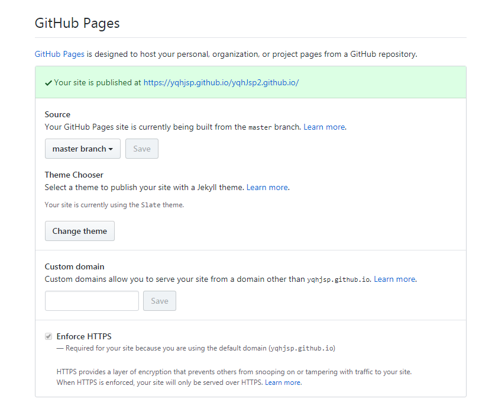

## 使用hexo在本地新建一个站点，使用控制台命令或者git bash在本地找个适合的位置博客地点

```bash
hexo init  myHexoBlog       //myHexoBlog是项目名
```
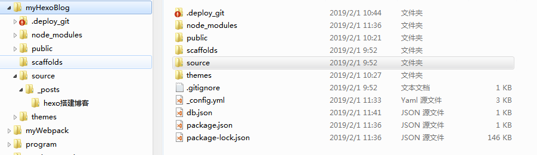

下面来测试本地博客站点，在本地博客根目录下使用控制台命令：

```bash
hexo g  //g是generetor的缩写，生成博客

hexo s  //s是server的缩写，启动服务
```
此时打开浏览器，输入 http://localhost:4000/，我们将会看到Hexo自带默认主题显示的博客样式如下(呃，是好看了那么一点点)：

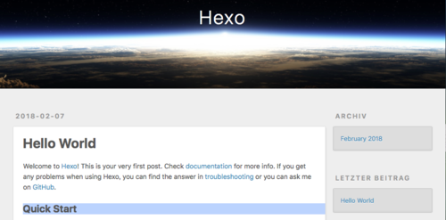


## 同步Github,允许公共访问

(1)复制github的仓库地址

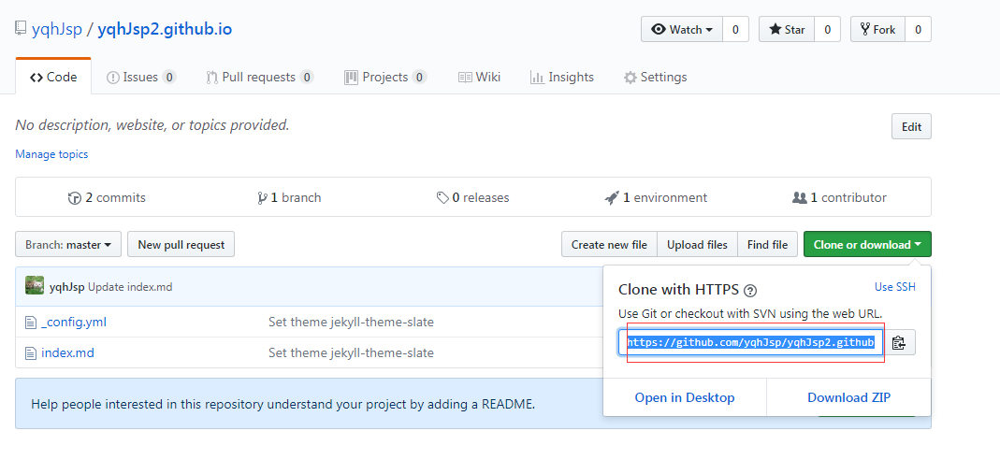

（2）然后修改本地博客目录的配置： 
修改本次博客根目录下的_config.yml文件，修改deploy下的配置如下：

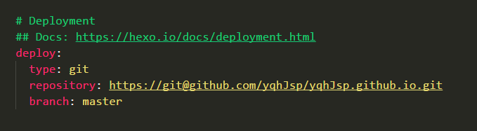

(3)最后执行控制台命令：
```bash
npm install hexo-deployer-git —save //安装部署插件
hexo d //部署到github
```

这样我们就可以使用https://yqhjsp.github.io/访问博客啦~!~

## 发布博客

激动人心的时刻来啦,下面让我来发布一篇博文试试看~~~
输入以下命令:
```bash
hexo new "vue项目使用vuescroll滚动"

hexo g   //生成网页

hexo d  //部署到远端(github)
```

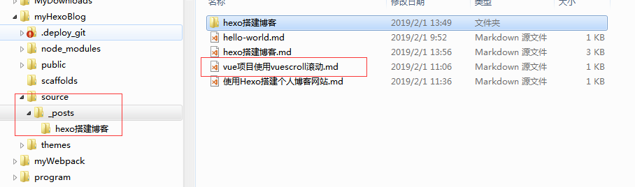

然后打开https://yqhjsp.github.io/，就可以看到博文了


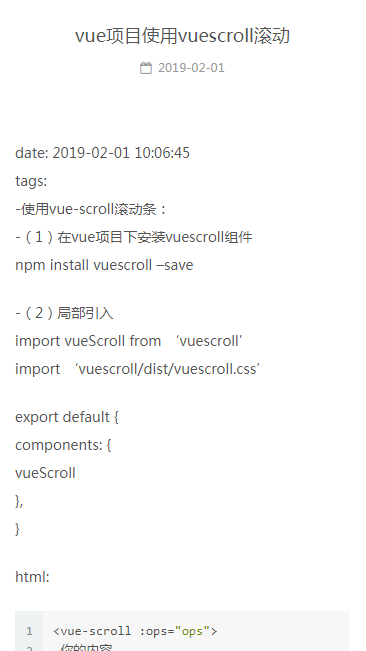

## 更换主题

（1）创建next文件夹

切换到本地博客根目录下，在主题文件thems下创建一个新文件夹next存放即将下载的next主题
```bash
$ mkdir themes/next

$ curl -L https://api.github.com/repos/iissnan/hexo-theme-next/tarball | tar -zxv -C themes/next --strip-components=1  
```
## 修改博客配置文件，更换主题配置

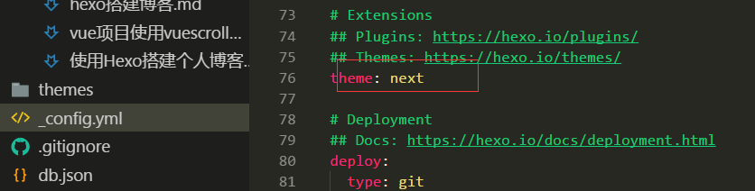

## 然后在控制台下输入如下命令：

```bash
hexo clean  //清理缓存

hexo g    //重新生成博客代码

hexo d   //部署到本地
```

下面就是更换主题后的博客啦

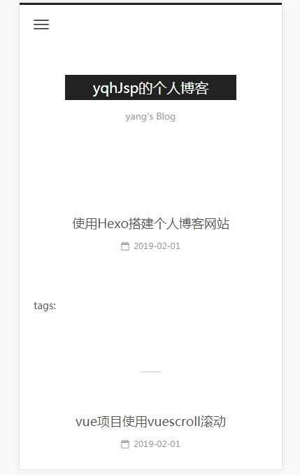


## 博客网站美化

首先说明一下：在Hexo中有两份主要的配置文件，其名称都是 _config.yml。 其中，一份位于站点根目录下，主要包含 Hexo本身的配置；另一份位于主题目录下，这份配置由主题作者提供，主要用于配置主题相关的选项。

## 站点配置：

在本地的博客根目录下找到_config.yml，用编辑器打开，如下：

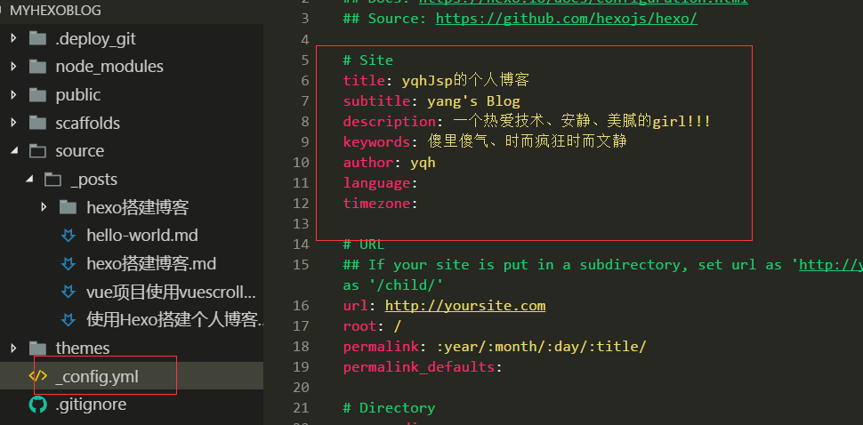

这里可以修改博客网站的标题、描述，语言等属性，上面更换主题也是在这个文件中修改的。大家可以在这里稍作设置

## 重点来了，在不同电脑管理hexo博客

其实，这也是我在使用Hexo搭建博客遇到的一个问题，如果我们检查自己博客在Github上的文件就会发现，github仓库里的文件和我们本地博客站点的文件夹是不同的，确切来说是少了很多内容。如果我们想在不同的电脑上管理自己的博客，就必须有源文件存在远端供我们随时下载、然后修改后重新部署到远端。

我们要理解这样一个过程：hexo -d是把本地博客源文件生成的静态网页文件同步到github上，实现部署。但是博客网站的源文件仍需要我们自己保存。这里主要有两种思路可以选择：

1.在github存放我们博客静态网页文件的仓库里另建分支brach，单独用于存放源文件。

(1)建立分支branch,切换到分支
(2)clone你的项目到你的Hexo目录下。例如我的是执行下面的命令：
```bash
git clone https://github.com/yqhJsp/yqhJsp.github.io.git
```
(3)进入该分支,把源码coby到clone的项目里,然后提交
```bash
git remote add origin https://github.com/yqhJsp/yqhJsp.github.io.git

git add .

git commit -m "hexo博客的源文件"

git push
```


2.将本地博客文件存放在码云上。

这些都是关于git的操作，所以这里不用细说了。单对于这两种方法来说，我更倾向于第二种。因为毕竟这些都是我们搭建个人博客的源文件，将来还要在网站上发表文章，很多数据都在这里。使用码云我们可以创建私有仓库，将这些源文件私有存放更好一些，而且源文件和静态博客网页文件分开存放也避免使用分支频繁切换。

## 七、遇到问题

1.修改了配置，网站没有变化

这种情况，大多因为修改后配置后我们直接部署，没有执行hexo clean。

2.代码无法高亮显示

在Hexo的next主题下，我们使用markDown编辑文章，如果代码无法高亮，这有可能是我们没有在标记语言后添加语言类型，我需要在添加代码片段的时候使用如下的样式：


