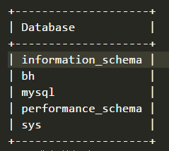

## node连接数据库的操作

提：自动安装的mysql不在/usr/bin目录下，所以需要重新设置环境变量 才可以在终端Yvonne目录下启动mysql

- 启动数据库 cmd: mysql -u root -p  //本地数据库
- 打开设置里的目录

* 1）新建数据库

mysql> show databases;
结果：



* 2 进入数据库）mysql> use bh
* 3 进入表）mysql> show tables;
* 4 新建表)

```bash
mysql> CREATE TABLE `blogInfo` (
    ->   `id` int(11) unsigned NOT NULL AUTO_INCREMENT COMMENT '主键ID值',
    ->   `status` int(11) NOT NULL DEFAULT '0' COMMENT '博文状态, 0：有效  1：停止   2：删除',
    ->   `contentSource` varchar(255) NOT NULL DEFAULT '' COMMENT '博文内容',
    ->   `blogId` varchar(255) NOT NULL DEFAULT '' COMMENT '博文ID',
    ->   `blogName` varchar(255) NOT NULL DEFAULT '' COMMENT '博文标题',
    ->   `blogParams` varchar(1024) NOT NULL DEFAULT '' COMMENT '参数',
    ->   `createTime` datetime NOT NULL DEFAULT CURRENT_TIMESTAMP COMMENT '创建时间',
    ->   `updateTime` datetime NOT NULL DEFAULT CURRENT_TIMESTAMP ON UPDATE CURRENT_TIMESTAMP COMMENT '更新时间',
    ->   PRIMARY KEY (`id`)
    -> ) ENGINE=InnoDB DEFAULT CHARSET=utf8;
* 5 show表）
mysql> show tables;
```
结果：
```objc
+-------------------+
| Tables_in_bh      |
+-------------------+
| blogInfo |
+-------------------+
```


### Egg node项目框架
2.后端sequelize连接数据库

1）关联数据库

	var sequelize = new Sequelize('database', 'username', 'password', {…

2）关联模型

	const Project = sequelize.define('project', {
	  title: Sequelize.STRING,//定义字段类型
	  description: Sequelize.TEXT
	})
  
	要定义模型和表之间的映射，请使用define方法。

3）操作数据库
```objc
app/controller/operaterLog
       
Project.findOne()	

4）调用的接口app/public/src/service

5）页面app/public/page/operaterlog
	Async函数返回的是一个promise对象
	promise函数 需要用resolve接收返回结果
	注意箭头函数不绑定this
```

Ssdb是当数据库挂了数据会自动先保存到本地