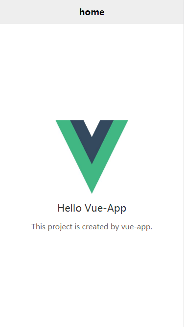
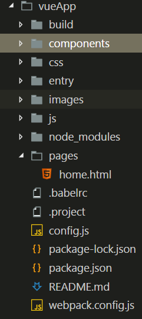

### vue-app-cli
可以快速构建基于vue的app多页应用，对h5页面app和html5 plus原生app都十分友好。

#### 它实现了以下功能：

* 快速生成app模板
* 快速创建新页面
* 支持es6
* 支持.vue文件
* 基于sass编写样式文件
* 模块导入样式文件
* 错误映射

#### 1、环境搭建
```bash
npm i vue-app-cli -g
```
然后随便进入个文件夹，执行命令vue-app，查看是否可以全局使用


#### 2、构建项目目录
注：所有的命令均必须在项目的根目录中输入，在本例子中是vueApp

(1)在根目录下创建工程，在命令行中输入vue-app init vueApp;

(2)进入到vueApp文件夹下，安装依赖cd vueApp && npm i，之后使用npm start启动项目，双击pages/home.html


(3)目录结构如下：



* build存放构建好的js和css
* components存放每个页面的根组件，你可以在每个文件夹内部扩展其他组件
* css存放页面样式，建议将通用样式和框架样式放入其中，页面自己的样式写入到.vue中
* entry存放每个页面的入口js文件，例如：home页的入口文件为entry/home.js
* images存放图片
* js存放页面逻辑，建议将通用逻辑和框架js放入其中，页面自己的逻辑写入到.vue中
* pages存放页面


